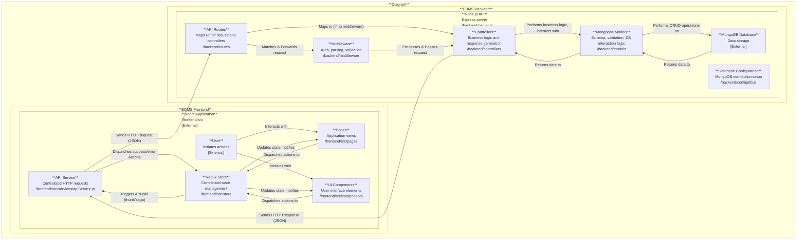

# Unnamed CodeViz Diagram

```mermaid
graph TD

    subgraph b1a25d0e-group["**Diagram**<br>[External]"]
        subgraph b1a25d0e-backend_boundary["**EDMS Backend**<br>Node.js/Express API<br>/backend"]
            subgraph b1a25d0e-nodejs_api_boundary["**Node.js API**<br>Express server<br>/backend/server.js"]
                b1a25d0e-api_routes["**API Routes**<br>Maps HTTP requests to controllers<br>/backend/routes"]
                b1a25d0e-controllers["**Controllers**<br>Business logic and response generation<br>/backend/controllers"]
                b1a25d0e-database["**MongoDB Database**<br>Data storage<br>[External]"]
                b1a25d0e-db_config["**Database Configuration**<br>MongoDB connection setup<br>/backend/config/db.js"]
                b1a25d0e-middleware["**Middleware**<br>Auth, parsing, validation<br>/backend/middleware"]
                b1a25d0e-models["**Mongoose Models**<br>Schema, validation, DB interaction logic<br>/backend/models"]
                %% Edges at this level (grouped by source)
                b1a25d0e-api_routes["**API Routes**<br>Maps HTTP requests to controllers<br>/backend/routes"] -->|"Matches & Forwards request"| b1a25d0e-middleware["**Middleware**<br>Auth, parsing, validation<br>/backend/middleware"]
                b1a25d0e-api_routes["**API Routes**<br>Maps HTTP requests to controllers<br>/backend/routes"] -->|"Maps to (if no middleware)"| b1a25d0e-controllers["**Controllers**<br>Business logic and response generation<br>/backend/controllers"]
                b1a25d0e-middleware["**Middleware**<br>Auth, parsing, validation<br>/backend/middleware"] -->|"Processes & Passes request"| b1a25d0e-controllers["**Controllers**<br>Business logic and response generation<br>/backend/controllers"]
                b1a25d0e-controllers["**Controllers**<br>Business logic and response generation<br>/backend/controllers"] -->|"Performs business logic, interacts with"| b1a25d0e-models["**Mongoose Models**<br>Schema, validation, DB interaction logic<br>/backend/models"]
                b1a25d0e-models["**Mongoose Models**<br>Schema, validation, DB interaction logic<br>/backend/models"] -->|"Performs CRUD operations on"| b1a25d0e-database["**MongoDB Database**<br>Data storage<br>[External]"]
                b1a25d0e-models["**Mongoose Models**<br>Schema, validation, DB interaction logic<br>/backend/models"] -->|"Returns data to"| b1a25d0e-controllers["**Controllers**<br>Business logic and response generation<br>/backend/controllers"]
                b1a25d0e-database["**MongoDB Database**<br>Data storage<br>[External]"] -->|"Returns data to"| b1a25d0e-models["**Mongoose Models**<br>Schema, validation, DB interaction logic<br>/backend/models"]
            end
        end
        subgraph b1a25d0e-frontend_boundary["**EDMS Frontend**<br>React/Redux Application<br>/frontend"]
            subgraph b1a25d0e-react_app_boundary["**React Application**<br>/frontend/src<br>[External]"]
                b1a25d0e-api_service["**API Service**<br>Centralized HTTP requests<br>/frontend/src/services/apiService.js"]
                b1a25d0e-pages["**Pages**<br>Application views<br>/frontend/src/pages"]
                b1a25d0e-redux_store["**Redux Store**<br>Centralized state management<br>/frontend/src/store"]
                b1a25d0e-ui_components["**UI Components**<br>User interface elements<br>/frontend/src/components"]
                b1a25d0e-user["**User**<br>Initiates actions<br>[External]"]
                %% Edges at this level (grouped by source)
                b1a25d0e-user["**User**<br>Initiates actions<br>[External]"] -->|"Interacts with"| b1a25d0e-pages["**Pages**<br>Application views<br>/frontend/src/pages"]
                b1a25d0e-user["**User**<br>Initiates actions<br>[External]"] -->|"Interacts with"| b1a25d0e-ui_components["**UI Components**<br>User interface elements<br>/frontend/src/components"]
                b1a25d0e-pages["**Pages**<br>Application views<br>/frontend/src/pages"] -->|"Dispatches actions to"| b1a25d0e-redux_store["**Redux Store**<br>Centralized state management<br>/frontend/src/store"]
                b1a25d0e-ui_components["**UI Components**<br>User interface elements<br>/frontend/src/components"] -->|"Dispatches actions to"| b1a25d0e-redux_store["**Redux Store**<br>Centralized state management<br>/frontend/src/store"]
                b1a25d0e-redux_store["**Redux Store**<br>Centralized state management<br>/frontend/src/store"] -->|"Triggers API call (thunk/saga)"| b1a25d0e-api_service["**API Service**<br>Centralized HTTP requests<br>/frontend/src/services/apiService.js"]
                b1a25d0e-redux_store["**Redux Store**<br>Centralized state management<br>/frontend/src/store"] -->|"Updates state, notifies"| b1a25d0e-pages["**Pages**<br>Application views<br>/frontend/src/pages"]
                b1a25d0e-redux_store["**Redux Store**<br>Centralized state management<br>/frontend/src/store"] -->|"Updates state, notifies"| b1a25d0e-ui_components["**UI Components**<br>User interface elements<br>/frontend/src/components"]
                b1a25d0e-api_service["**API Service**<br>Centralized HTTP requests<br>/frontend/src/services/apiService.js"] -->|"Dispatches success/error actions"| b1a25d0e-redux_store["**Redux Store**<br>Centralized state management<br>/frontend/src/store"]
            end
        end
        %% Edges at this level (grouped by source)
        b1a25d0e-api_service["**API Service**<br>Centralized HTTP requests<br>/frontend/src/services/apiService.js"] -->|"Sends HTTP Request (JSON)"| b1a25d0e-api_routes["**API Routes**<br>Maps HTTP requests to controllers<br>/backend/routes"]
        b1a25d0e-controllers["**Controllers**<br>Business logic and response generation<br>/backend/controllers"] -->|"Sends HTTP Response (JSON)"| b1a25d0e-api_service["**API Service**<br>Centralized HTTP requests<br>/frontend/src/services/apiService.js"]
    end

```
---
*Generated by [CodeViz.ai](https://codeviz.ai) on 10/3/2025, 2:20:03 PM*
